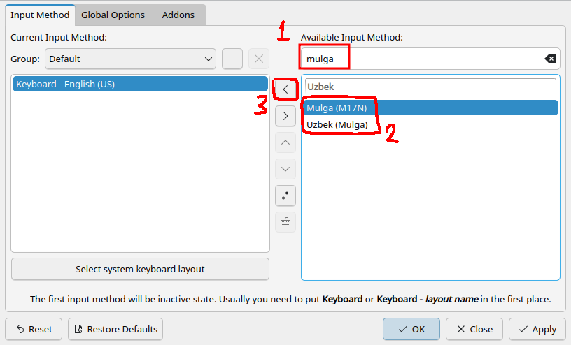

# Make Uzbek Language Great Again

Uzbek now writes four of its digraphs as single letters:

| you type | you get |
| --- | --- |
| `sh` | `ş` |
| `ch` | `ç` |
| `o'` | `ö` |
| `g'` | `ǧ` |

Nothing ships a keyboard for that yet. Mulga is one. You type `sh` exactly as
you always have and `ş` is what comes out — no new keys to learn, no key you
have to press twice, nothing else about your keyboard moved.

We support Linux and macOS. Windows is not supported yet, and README.md says
why.

Everything below assumes you have this repository:

```sh
git clone https://github.com/drdilyor/mulga
cd mulga
```

## macOS

Copy the layout in:

```sh
mkdir -p ~/Library/Keyboard\ Layouts
cp macos/UzbekMulga.keylayout ~/Library/Keyboard\ Layouts/
```

**Log out and log back in.** macOS only looks for new layouts at login, so this
step is not optional and nothing will appear until you do it.

Then open System Settings, go to Keyboard, and next to Input Sources press
Edit, then `+`. Add **Uzbek (Mulga)** — under Uzbek, or under Others if it is
not there. Switch to it from the input menu in the menu bar.

That is the whole install. No signing, no notarisation, no administrator
password: a keyboard layout is data, not a program.

It is a complete U.S. layout with the four rules added, so every other key,
including the option characters and the accent dead keys, stays where it was.

> This is the one route nobody has been able to try on real hardware yet. It is
> checked thoroughly by simulation, but if it misbehaves on a real Mac, that is
> worth an issue.

## Linux

Three ways in. The first two install the same file and behave the same; pick
whichever input framework your desktop already runs.

| | choose this if |
| --- | --- |
| [ibus](#ibus) | you run GNOME, or you do not know what you run |
| [fcitx5](#fcitx5) | you already run fcitx5, or you run KDE |
| [the fcitx5 addon](#the-fcitx5-addon) | you are me |

### ibus

GNOME's default, and what most desktops ship.

Install the m17n engine:

```sh
sudo apt install ibus-m17n       # Debian, Ubuntu
sudo dnf install ibus-m17n       # Fedora
sudo pacman -S ibus-m17n         # Arch
```

On NixOS, in your system configuration:

```nix
i18n.inputMethod = {
  enable = true;
  type = "ibus";
  ibus.engines = [ pkgs.ibus-engines.m17n ];
};
```

Then drop the input method into your home directory and restart ibus:

```sh
mkdir -p ~/.m17n.d
cp m17n/uz-Mulga.mim ~/.m17n.d/
ibus restart
```

Open Settings, then Keyboard, then Input Sources, press `+`, choose Uzbek, and
pick **uz-Mulga (m17n)**.

### fcitx5

Install fcitx5, its m17n engine and the configuration tool:

```sh
sudo apt install fcitx5 fcitx5-m17n fcitx5-configtool       # Debian, Ubuntu
sudo dnf install fcitx5 fcitx5-m17n fcitx5-configtool       # Fedora
sudo pacman -S fcitx5 fcitx5-m17n fcitx5-configtool         # Arch
```

On NixOS:

```nix
i18n.inputMethod = {
  enable = true;
  type = "fcitx5";
  fcitx5.addons = [ pkgs.fcitx5-m17n ];
};
```

Then the same file, and restart fcitx5:

```sh
mkdir -p ~/.m17n.d
cp m17n/uz-Mulga.mim ~/.m17n.d/
fcitx5 -r &
```

Run `fcitx5-configtool`, type `mulga` in the search box, and add **Mulga
(M17N)** with the `<` button:



Leave `Keyboard - English (US)`, or whatever your normal layout is, first in
the left-hand list. The first entry there is the one you get when the input
method is switched off, and if Mulga is first you will have nowhere to switch
back to.

### The fcitx5 addon

This method is only for myself. As such, I refuse to elaborate on how to
install it.

(README.md, under Development, if you insist.)

## Checking it worked

Type `shahar`. You should get `şahar`.

A few things that are meant to happen:

- Nothing appears when you press `s` on its own — it waits one keystroke to see
  whether an `h` is coming. Press anything else and the `s` arrives normally.
- `as'hob` stays `as'hob`. The apostrophe releases the `s`, so the `h` after it
  is still its own letter.
- Both `o'` and `` o` `` give `ö`, and so does a real `oʻ` if your keyboard has
  one.

To type a literal `sh` or `ch` — in a foreign word, say — switch back to your
normal input method for it. `school` will otherwise come out `sçool`.
